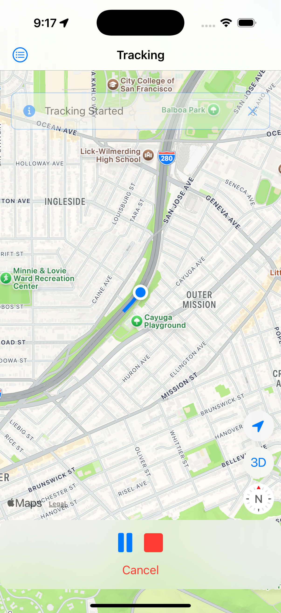
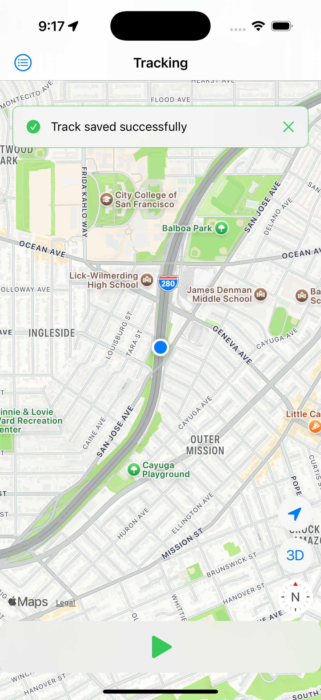
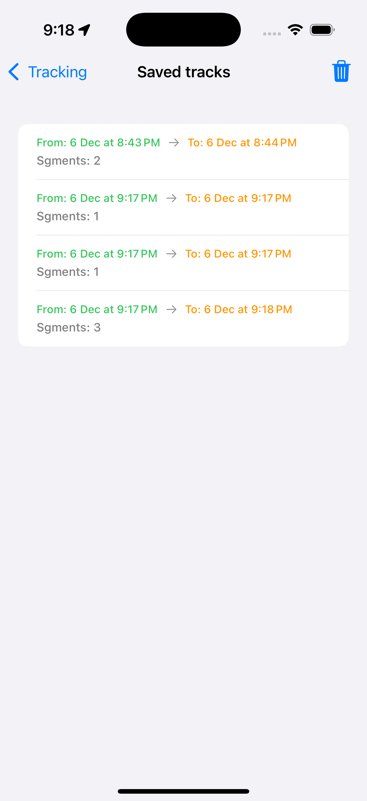
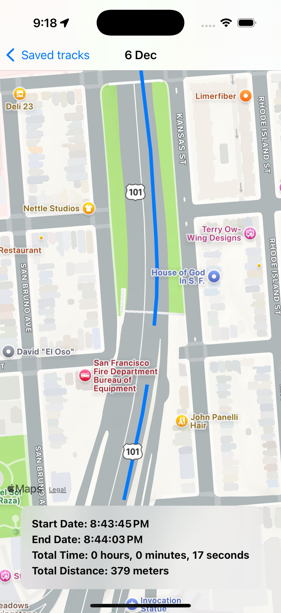

# LocationTrace

## Overview
**LocationTrace** is a location-tracking application designed to record and manage journeys efficiently. The app uses a structured data model to track journeys, divide them into segments, and store detailed location points.

## Environment
- **Xcode Version**: 16.1  
- **iOS Minimum Version**: iOS 17  
- **Swift Version**: 6  

## Technologies Used
- **SwiftData**: Enables efficient local data storage and retrieval for Tracks, Segments, and LocationPoints.  
- **CoreLocation**: Captures the device's geographic location and manages location services.  
- **MapKit**: Visualizes geographic data on maps, including user-recorded tracks and segments.  

## Data Structure Design

### 1. **Track**
- Represents a complete journey or recording session.  
- Contains:  
  - **Start Date** and optional **End Date**.  
  - List of **Segments**.  
  - **Total Distance** calculated by summing distances of all segments.  

### 2. **Segment**
- Represents a section of a journey.  
- Contains:  
  - **Start Date** and optional **End Date**.  
  - List of **LocationPoints**.  
  - **Distance** calculated from the points' coordinates.  
  - Associated with one **Track**.  

### 3. **LocationPoint**
- Represents an individual geographic point.  
- Contains:  
  - **Latitude**, **Longitude**, and **Timestamp**.  
  - Belongs to a specific **Segment**.  

This hierarchical design ensures efficient organization and management of location data, making the app scalable and modular.

## Demo
[Watch the App Demo](https://drive.google.com/file/d/153g25rHx6zneAwV292K0CJ6r_zODAZBG/view?usp=drive_link)

## Screenshots
Here are some screenshots showcasing the app:  
  
  
  
  
  

## Note
Special thanks to **Khalid Zayat** for trying to assist with an issue related to the project file structure in **Xcode 16.1**. Despite the problem persisting, your effort and support are greatly appreciated!
